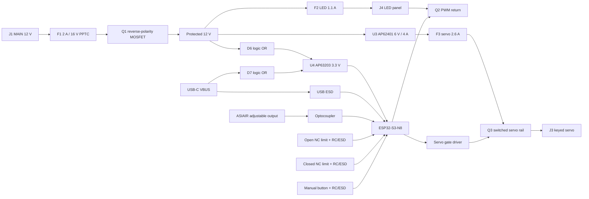

# Rev C circuit and connector map

## Connectors

| Ref | Purpose | Pinout / note |
|---|---|---|
| J1 | MAIN 12 V | centre positive; board rating 2 A continuous |
| J2 | ASIAIR signal | centre positive from adjustable ASIAIR DC output; isolated, not actuator power |
| J3 | keyed servo | 1 = switched 6 V, 2 = GND, 3 = PWM signal |
| J4 | LED panel | 1 = fused 12 V, 2 = MOSFET-switched negative |
| J5 | open limit | 1 = signal, 2 = GND; wire switch COM-NC |
| J6 | closed limit | 1 = signal, 2 = GND; wire switch COM-NC |
| J7 | external manual | 1 = signal, 2 = GND; normally-open button |
| J8 | USB-C | firmware, ASCOM data, and logic-only power |
| J9 | recovery | 1 3V3, 2 GND, 3 TX0, 4 RX0, 5 EN, 6 BOOT |

With fail-safe NC limits, both inputs read LOW during mid-travel. The active endpoint
opens its switch and reads HIGH. A broken limit wire therefore stops motion instead of
silently removing endpoint protection. Both limits HIGH simultaneously is a latched fault.

## GPIO allocation

| Function | GPIO |
|---|---:|
| ASIAIR isolated PWM | 4 |
| LED PWM | 5 |
| Open NC limit | 6 |
| Closed NC limit | 7 |
| Servo power enable | 8 |
| Manual button | 9 |
| MAIN 12 V sense | 10 |
| Status LED | 15 |
| Servo PWM | 18 |
| USB D- / D+ | 19 / 20 |
| UART TX / RX | 43 / 44 |

The ESP32 module antenna faces the board edge. The four-layer layout uses a solid inner
ground reference. Keep metal enclosure parts and cable bundles at least 15 mm from the
antenna end if future Wi-Fi/Bluetooth firmware is used.
