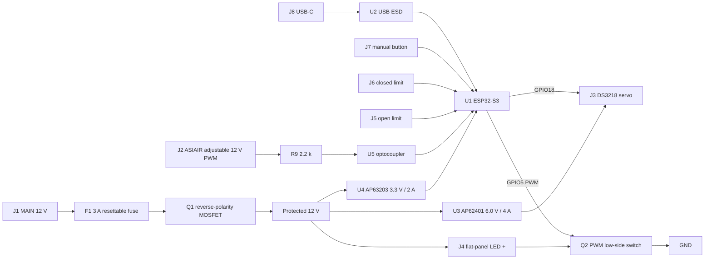

# Integrated circuit diagram and connector map

## ESP32-S3 signals

| Function | GPIO |
|---|---:|
| ASIAIR optocoupler input | 4 |
| LED PWM | 5 |
| Open limit | 6 |
| Closed limit | 7 |
| Manual button | 9 |
| Servo PWM | 18 |
| USB D- / D+ | 19 / 20 |
| Status LED | 15 |

The AP62401 feedback divider is 64.9 k / 10 k for nominal 6.0 V. R18 pulls its enable input high. The ESP32-S3 rail is a fixed 3.3 V AP63203. C2 and C7 provide input and servo transient energy. D1 clamps input transients; Q1 and F1 handle reverse polarity and sustained over-current.
